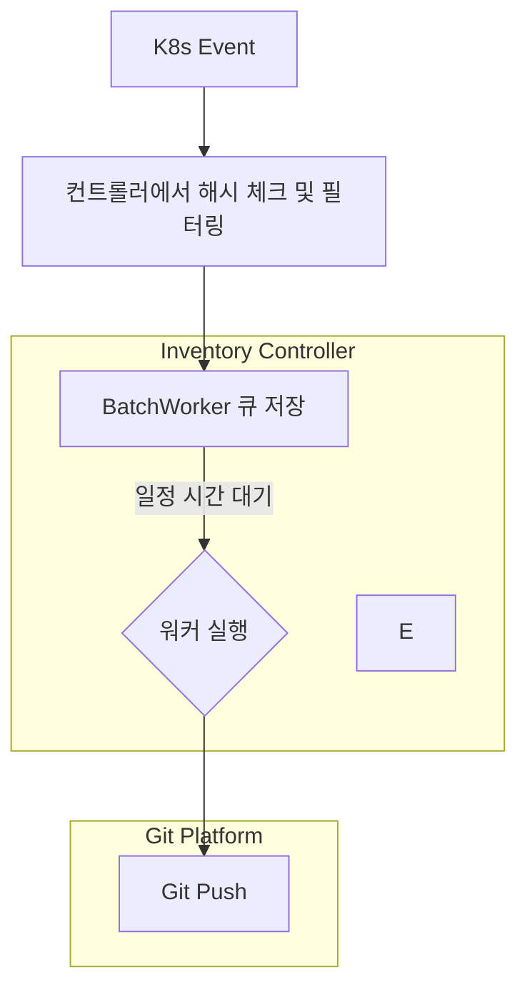
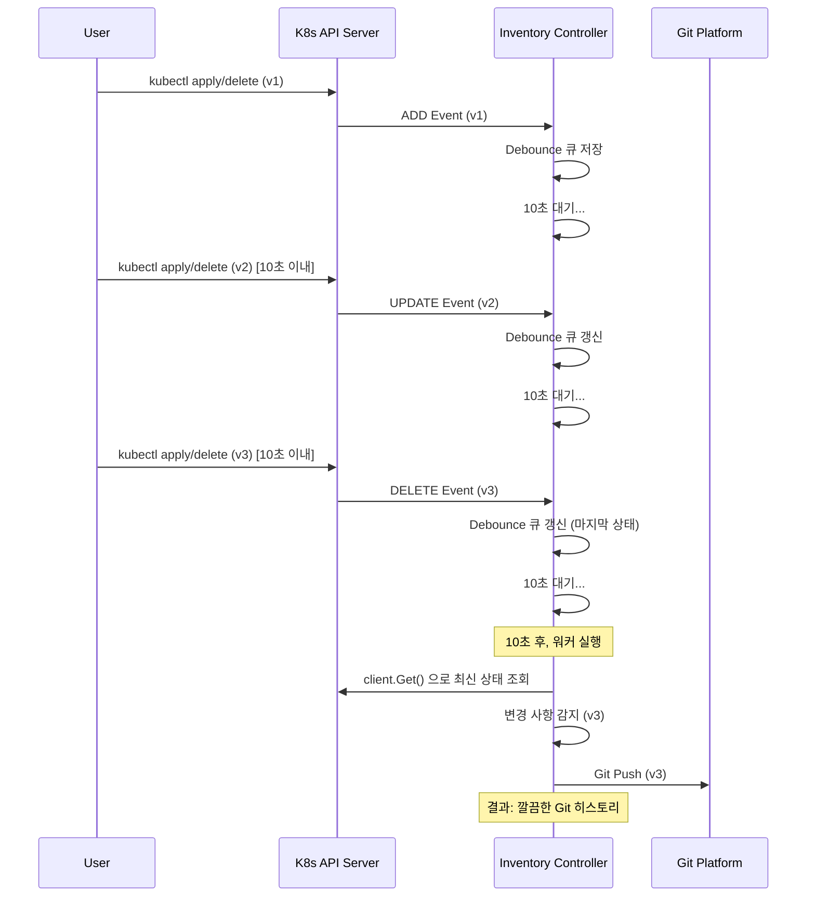

# ADR-0010: Race Condition Squash Defense

## 1. 배경
클러스터 운영 중에는 사용자의 단순 변심, 조작 실수(예: `kubectl apply` 직후 `kubectl delete` 연타), 혹은 다른 자동화 파이프라인의 오작동으로 인해 특정 리소스가 수 초 내에 '생성 ➔ 수정 ➔ 삭제'를 반복하는 플래핑(Flapping) 현상이 발생할 수 있습니다.
만약 Inventory Controller가 발생하는 모든 이벤트(Edge-Trigger)를 1:1로 추적하여 Git에 커밋한다면, Git 히스토리가 무의미한 커밋으로 도배되고 Git 플랫폼(GitHub, GitLab)에 과도한 네트워크 부하 및 Rate Limit 초과를 유발하게 됩니다.

## 2. 결정
이러한 경쟁 상태(Race Condition)와 플래핑을 방어하기 위해, Kubernetes 본연의 상태 기반(Level-Trigger) 설계 철학과 10초 디바운싱(Debouncing) 큐를 결합하여 중간 변경 사항을 압축(Squash)하는 방식을 채택합니다.
리소스 변경 이벤트가 발생하면 즉시 처리하지 않고 인메모리 큐에 10초간 지연(Delay)시킵니다.
지연 시간이 만료되어 실제 워커(Worker)가 동작할 때, 큐에 쌓인 이벤트 로그를 순차적으로 재현하는 것이 아니라 **해당 시점의 클러스터(Informer Cache) 최신 상태를 단 한 번만 조회(client.Get)**하여 처리합니다.
- 사용자가 리소스를 빠르게 여러 번 수정하거나 삭제 요청을 연속으로 보낼 때, Inventory Controller는 이를 즉시 처리하지 않고 내부 큐(BatchWorker)에 위임하여 중복을 최소화하고 최종 상태만 Git에 커밋합니다.

## 3. 이유
- **Git 플랫폼 리밋(Rate Limit) 방어:** 플래핑(Flapping)으로 인해 발생하는 수십 번의 무의미한 Push 요청을 차단하여 GitHub/GitLab의 API Rate Limit 초과 및 IP 차단 위험을 방지합니다.
- **상태 기반(Level-Trigger) 설계와의 일치:** K8s의 Reconcile 큐(workqueue)는 객체의 상태(Payload)가 아닌 식별자(Namespace/Name)만을 저장합니다. 10초 지연 후 워커가 동작할 때 client.Get()을 통해 단 한 번만 최신 상태를 읽어오므로, 중간에 발생한 무의미한 변경 과정을 완벽히 생략(Squash)할 수 있습니다.
- **히스토리 가독성(SSOT) 확보:** 10초 내에 발생한 생성->수정->삭제와 같은 노이즈를 필터링하고 인프라의 '최종 형상'만 커밋으로 남김으로써, 운영자가 파악해야 할 Git 히스토리의 가독성과 신뢰도를 높입니다.
- **시스템 리소스 최적화:** 짧은 시간에 집중적으로 발생하는 이벤트를 하나의 배치(Batch)로 흡수하여 Inventory Controller의 CPU/Memory 사용량과 불필요한 Git I/O(Clone, Commit, Push)를 획기적으로 절감합니다.

## 4. 결과
- Inventory Controller는 `Add`, `Update`, `Delete` 이벤트를 수신하면 즉시 큐에 추가하고, 10초간 새로운 이벤트가 들어오지 않으면(Debounce) 큐를 비우며 워커를 실행합니다.
- 큐에서 최종 이벤트를 읽어올 때, 실제 큐에 쌓인 이벤트 로그(Event Logs)를 일일이 파싱하여 적용하는 것이 아니라, 컨트롤러가 기억하고 있는 `lastAppliedHash`를 이용해 **`client.Get()`으로 최신 상태의 리소스를 직접 조회**하여 처리합니다.
- 이를 통해 수십 번의 중복 변경 시도가 단 한 번의 Git 커밋으로 압축되어, Git 저장소의 커밋 히스토리가 항상 '의미 있는 최종 상태'만으로 구성됩니다.

## 5. 구현
- **큐 인터페이스**: `client-go/util/workqueue`의 `RateLimitingInterface` 활용.
- **디바운스 로직**: 이벤트 발생 시 Add(item) 대신 AddAfter(item, 10 * time.Second)를 호출하여 큐의 인입 시점을 지연.
- **최종 상태 평가**: Reconciler 로직 초입에서 `client.Get()`을 통해 현재 캐시의 최종 상태만 획득. 객체가 존재하지 않으면 이전에 큐에 들어온 Add/Update 이벤트더라도 모두 Delete 로직(Archive)으로 분기.

### 5.1. 큐 및 워커 위임 로직
```go
// internal/inventory/reconciler.go

func (d *ReconcileDeps) handle(ctx context.Context, req ctrl.Request, obj client.Object, kind string) (ctrl.Result, error) {
    // 1. 최신 상태 조회 및 해시 계산 (이벤트 로그가 아닌 실제 클러스터 상태 기반)
    yamlBytes, currentHash, err := NormalizedYAMLAndMaterialHash(obj)
    if err != nil {
        return ctrl.Result{}, fmt.Errorf("normalize and hash object: %w", err)
    }

    // (중략) 캐시 및 어노테이션 비교를 통한 무한 루프 차단 로직

    relPath, err := RenderExportPath(d.ExportPathTmpl, kind, req.Namespace, req.Name)
    
    // 2. 즉시 Git 조작을 하지 않고 BatchWorker 큐에 전달 (디바운스 처리 위임)
    d.GitQueue.Enqueue(git.ExportJob{Path: relPath, Content: yamlBytes})
    log.Info("Enqueued inventory export", "kind", kind, "namespace", req.Namespace, "name", req.Name, "path", relPath)
    
    return ctrl.Result{}, nil
}
```
### 5.2. 아키텍처 다이어그램


### 5.3. 시퀀스 다이어그램

