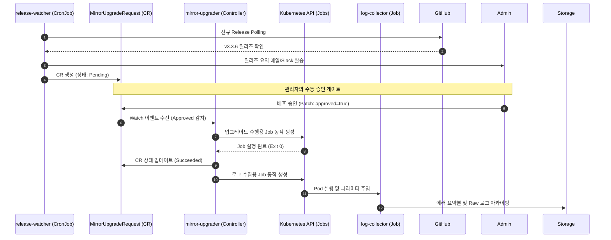
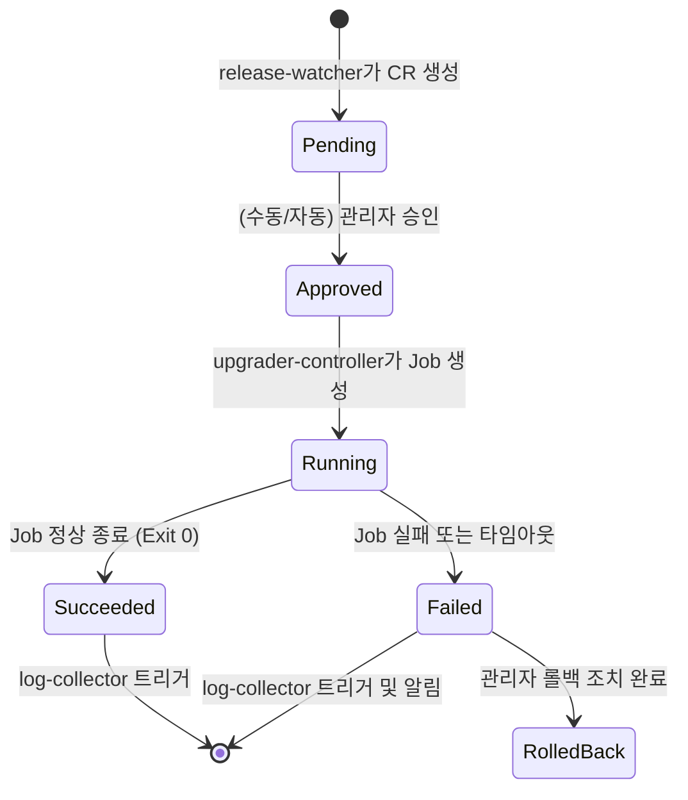

# accord 아키텍처 초안

## 1. 문서 목적
이 문서는 Argo CD 기반의 형상 관리 자동화 및 안전한 업그레이드 파이프라인을 구축하는 `accord` 프로젝트를 실제 구현 가능한 수준으로 구조화하기 위한 **아키텍처 설계 초안**이다.

본 문서가 지향하는 구체적인 목적은 다음과 같다.

- **기능 및 역할 정의:** `accord` 시스템이 제공하는 핵심 기능들을 명시적으로 서술하고, 각 기능별 책임을 명확히 정의한다.
- **컴포넌트 상호작용 설계:** `accord`를 구성하는 컴포넌트들이 Kubernetes 환경에서 각각 어떤 리소스(Kind)로 배포되는지 결정하고, 이들이 시스템 내에서 어떻게 유기적으로 연결되어 동작하는지 설명한다.
- **상태 제어 및 데이터 흐름 확립:** 컴포넌트 간의 데이터 흐름과 책임 경계를 설정하고, Git 저장소 동기화 구조 및 CRD(Custom Resource Definition)를 활용한 시스템 제어 방향성을 확립한다.

---

## 2. 핵심 목표

Accord는 운영 중인 Argo CD 환경의 안정성과 가시성을 극대화하기 위해 다음 두 가지 핵심 목표를 달성하고자 한다. 클러스터 형상의 완벽한 복제(Replication)를 통해 관리 기반을 다지고, 이를 바탕으로 안전한 라이프사이클(Upgrade) 관리를 수행하는 것이 전체 시스템의 논리적 구조다.

### 2.1 Argo CD 리소스 모니터링 및 양방향 복제 (Monitoring & Replication)
클러스터 내에서 동작 중인 Argo CD 리소스들의 실제 상태를 투명하게 모니터링하고, Git과 클러스터 중 어느 곳에서 수정이 발생하더라도 완벽하게 동기화되는 양방향 형상 관리 체계를 구축한다.

- **목표 (Goal):** 선언적 상태(Git)와 실제 배포 상태(Cluster) 간의 간극(Drift)을 파악하고, 클러스터 내의 직접적인 형상 변경을 추적 및 자산화한다.
- **수단 및 전략 (Strategy):**
  - **안전한 양방향 동기화:** 클러스터 리소스를 감시하여 Git에 백업(Export)하는 동시에, Git의 변경 사항을 Webhook으로 수신하여 클러스터에 반영(Deploy)하는 구조를 통해 Git을 실질적인 단일 진실 공급원(SSOT)으로 유지한다.
  - **상태 정규화:** Kubernetes 시스템 필드(`status`, `uid` 등)를 배제한 정규화(Normalization)된 매니페스트를 추출하여 데이터의 무결성을 확보한다.
  - **사전 검증:** 동기화된 형상 데이터를 바탕으로 Dry-run을 수행하여 복제 및 적용 가능성을 지속적으로 검증한다.

### 2.2 Mirror 환경의 무중단 라이프사이클 관리 (Safe Lifecycle Management)
기반 인프라인 Argo CD 자체의 버전 업데이트 및 유지보수 작업을 휴먼 에러 없이 안전하고 추적 가능한 파이프라인으로 통제한다.

- **목표 (Goal):** 릴리즈 감지부터 배포, 검증, 사후 분석까지 이어지는 업그레이드 전 과정을 시스템화하여 운영 리스크를 최소화한다.
- **수단 및 전략 (Strategy):**
  - **이벤트 기반 통제:** 신규 릴리즈를 자동으로 감지하고, 수동/자동 승인 게이트(`MirrorUpgradeRequest` CRD)를 통해 배포 시점을 엄격히 제어한다.
  - **독립적 실행 환경:** 실제 업그레이드 작업과 검증을 일회성 Job으로 격리하여 실행함으로써 메인 컨트롤러의 안정성을 보장한다.
  - **관측성 확보:** 작업 완료 후 관련 컴포넌트의 로그를 자동으로 아카이빙하고 분석하여, 장애 발생 시 즉각적인 디버깅이 가능한 환경을 제공한다.

---

## 3. 핵심 설계 원칙

### 3.1 동시성 제어 및 무한 루프 방지 (Hash Validation)
완전한 양방향 동기화를 달성하면서도 시스템 무한 루프를 방지하기 위해 **해시(Hash) 기반 멱등성 검증**을 최우선 원칙으로 삼는다.

- **이벤트 병합:** `client-go`의 `RateLimitingQueue`를 사용하여 이벤트를 수집하며, 동일 리소스에 대한 연속된 이벤트는 5초간 지연(Debouncing) 처리한다.
- **Git 충돌 방지:** Reconcile 루프는 로컬 YAML 정규화만 수행하며, Git Push는 별도의 Batch Worker가 주기적으로 모아 단일 커밋으로 전송한다.
- **무한 루프(Loop Break) 전략:** 클러스터의 변경 사항을 정규화하여 SHA-256 해시를 계산하고 이를 메모리/캐시에 저장한다. 이후 Git Webhook을 통해 클러스터에 리소스가 다시 배포(Apply)되어 업데이트 이벤트가 발생하더라도, 컨트롤러는 이전에 저장해둔 해시값과 동일함을 인지하고 로직을 무시(Ignore)하여 연산 낭비와 루프를 원천 차단한다.

### 3.2 기능별 책임 분리 및 Pod 우선 분리
하나의 거대한 오퍼레이터에 모든 기능을 몰아넣기보다, 다음처럼 책임을 분리하고 **독립적인 Pod**로 배포한다. (사이드카 패턴은 강한 결합이 필요한 보조 기능에만 제한적으로 사용한다.)
- 상시 감시 및 Git Export (`inventory-controller`)
- Webhook 수신 및 배포 (`sync-operator`)
- 외부 릴리즈 감시기 (`release-watcher`)
- 이벤트성 업그레이드 실행기 (`mirror-upgrader`)
- 일회성 로그 수집기 (`log-collector`)

---

## 4. 컴포넌트 구성도

```text
+--------------------------------------------------------------+
|                     accord namespace                         |
|                                                              |
|  +---------------------------+                               |
|  | accord-inventory-         |                               |
|  | controller (Deployment)   |                               |
|  | - App/AppSet watch        |                               |
|  | - YAML normalize/export   |                               |
|  | - Hash Compute/Cache      |                               |
|  +-------------+-------------+                               |
|                | Git Push                                    |
|                v                                             |
|       +--------------------+                                 |
|       | Git Repository     |                                 |
|       | - main branch      |                                 |
|       +---------+----------+                                 |
|                 | Webhook (Push Event)                       |
|                 v                                            |
|  +---------------------------+                               |
|  | accord-sync-operator      |                               |
|  | (Deployment)              |                               |
|  | - Webhook Receiver        |                               |
|  | - Path & Kind Validation  |                               |
|  | - Apply to Cluster        |                               |
|  +---------------------------+                               |
|                                                              |
|  +---------------------------+                               |
|  | accord-release-watcher    |                               |
|  | (Deployment/CronJob)      |                               |
|  | - GitHub release polling  |                               |
|  | - upgrade request emit    |                               |
|  +-------------+-------------+                               |
|                |                                             |
|                v                                             |
|      +--------------------------+                            |
|      | MirrorUpgradeRequest CR  |                            |
|      +-------------+------------+                            |
|                    |                                         |
|                    v                                         |
|  +---------------------------+                               |
|  | accord-mirror-upgrader    |                               |
|  | (Job or Controller)       |                               |
|  | - spawn Job & rollout     |                               |
|  +-------------+-------------+                               |
|                |                                             |
|                v                                             |
|  +---------------------------+                               |
|  | accord-log-collector      |                               |
|  | (Job)                     |                               |
|  | - pod logs export         |                               |
|  +---------------------------+                               |
+--------------------------------------------------------------+
```

---

## 5. 컴포넌트별 상세 책임

`accord` 시스템은 단일 장애점(SPOF)을 없애고 각 기능의 독립적인 스케일링과 유지보수를 보장하기 위해, 역할을 5개의 마이크로 컴포넌트로 분리하여 설계되었다. 각 컴포넌트의 명세는 다음과 같다.

### 5.1 accord-inventory-controller
- **목적:** 클러스터 내 Argo CD 주요 리소스를 감시하여 정규화된 YAML 인벤토리를 생성하고 Git에 백업(Export)한다.
- **배포 모델:** `Deployment` (Replica: 1, Active-Standby 리더 선출 방식 적용)
- **주요 책임:**
  - 리소스의 Add/Update/Delete Kubernetes Watch 이벤트 수신 및 Debounce 큐잉
  - 시스템 필드를 제거한 리소스 정규화(Normalization) 및 SHA-256 해시 계산
  - 해시 기반의 무한 루프 차단 (자신의 변경 사항 무시)
  - 주기적인 Git Fetch/Rebase 및 변경 사항 Commit/Push
- **인터페이스 (입출력):**
  - `Input:` Kubernetes API Server Event, Git 저장소 상태
  - `Output:` 정규화된 YAML 파일, Git 커밋 이력

### 5.2 accord-sync-operator
- **목적:** Git에서 발생하는 형상 변경 이벤트를 수신하여 클러스터에 선별적으로 반영(Deploy)한다.
- **배포 모델:** `Deployment` (Replica: 2 이상 가능, Stateless Webhook 서버)
- **주요 책임:**
  - Git Provider(GitHub, GitLab 등)의 Push Webhook 수신 엔드포인트 제공
  - 수신된 페이로드(Payload)의 변경 파일 경로(Path)를 분석하여 Argo CD 유효 리소스 식별
  - 식별된 매니페스트를 대상 클러스터 네임스페이스에 Server-side Apply 방식으로 배포
- **인터페이스 (입출력):**
  - `Input:` Git Push Webhook Payload (JSON)
  - `Output:` 대상 클러스터 리소스 생성/수정/삭제 상태 (Kubernetes API Apply)

### 5.3 accord-release-watcher
- **목적:** Argo CD의 신규 공식 릴리즈를 감지하고, 업그레이드 파이프라인의 시작점인 이벤트를 발생시킨다.
- **배포 모델:** `CronJob` (예: 매일 오전 9시 실행)
- **주요 책임:**
  - GitHub Releases API를 Polling하여 이전 확인 버전과 비교
  - 릴리즈 노트의 핵심 변경 사항(Changelog) 수집 및 요약 포맷팅
  - 관리자에게 릴리즈 알림 발송 (Slack, Email 등)
  - 파이프라인 트리거를 위한 `MirrorUpgradeRequest` CR(Custom Resource) 생성
- **인터페이스 (입출력):**
  - `Input:` GitHub API 통신 결과, 내부 상태 캐시(마지막 감지 버전)
  - `Output:` 알림 메시지, `MirrorUpgradeRequest` (상태: Pending)

### 5.4 accord-mirror-upgrader
- **목적:** Mirror Argo CD 환경에 대해 승인 기반의 무중단 업그레이드 작업을 조율하고 실행한다.
- **배포 모델:** `Deployment` (CRD 감시 컨트롤러 패턴)
- **주요 책임:**
  - `MirrorUpgradeRequest`의 승인 상태(Approved) 감지
  - 실제 업그레이드를 수행할 일회성 작업(`Job`) 동적 생성 및 파라미터 주입
  - 업그레이드 Job의 완료 상태(Success/Fail) 대기 및 모니터링
  - 배포 후 대상 컴포넌트들의 Health Check 및 Smoke Test 수행
  - 완료 시 후속 처리를 위해 Log Collector Job 트리거
- **인터페이스 (입출력):**
  - `Input:` `MirrorUpgradeRequest` CR 상태 변화, 대상 버전 Manifest
  - `Output:` CR 상태 업데이트(Running -> Succeeded/Failed), 동적으로 생성된 `Job` 리소스

### 5.5 accord-log-collector
- **목적:** 업그레이드 작업 전후의 파드 로그를 수집 및 아카이빙하여 사후 감사(Audit) 및 에러 분석 환경을 제공한다.
- **배포 모델:** `Job` (Upgrader에 의해 동적으로 트리거됨)
- **주요 책임:**
  - 전달받은 시작/종료 시간 범위(`startTime`, `endTime`) 내의 대상 네임스페이스 파드 로그 추출
  - 알려진 에러 패턴(Known Issues) 매칭 및 필터링
  - 요약 리포트(JSON/Markdown) 생성 및 영구 스토리지에 결과물 압축 저장
- **인터페이스 (입출력):**
  - `Input:` 대상 네임스페이스, 시간 범위 (컨트롤러로부터 Env/Args로 주입됨)
  - `Output:` Raw 로그 파일 백업본, 에러 요약본 (예: `/data/mirror-argocd/logs/2026-04-15/summary.json`)

---

## 6. Kubernetes 리소스 배치 전략

시스템의 결합도를 낮추고(Decoupling), 특정 기능의 장애가 전체 시스템으로 전파(Cascading Failure)되는 것을 막기 위해 컴포넌트별 특성에 맞추어 실행 단위(Workload Kind)를 다음과 같이 분리한다.

| 기능 컴포넌트 | 권장 실행 단위 | 배치 및 분리 사유 (Architectural Decision) |
| :--- | :--- | :--- |
| **inventory-controller** | `Deployment` | 클러스터 이벤트를 놓치지 않기 위해 상시 Watch 및 Reconcile 루프가 무중단으로 동작해야 함 |
| **sync-operator** | `Deployment` | 외부(Git)에서 들어오는 Webhook을 지연 없이 즉각적으로 수신하고 처리해야 하는 Stateless 서버 |
| **release-watcher** | `CronJob` | GitHub API 요금제 제한(Rate Limit)을 고려하여 상시 실행보다는 주기적인 Polling(예: 1시간 단위)이 적합함 |
| **mirror-upgrader** | `Deployment` (Controller)<br>+ `Job` (Worker) | CR 상태를 감시하는 가벼운 메인 컨트롤러(`Deployment`)가 실제 무거운 업그레이드 작업을 수행할 일회성 파드(`Job`)를 동적으로 생성(Spawn)하여 장애를 격리함 |
| **log-collector** | `Job` | 업그레이드 완료 또는 실패 직후, 지정된 파라미터(시간, 네임스페이스)를 가지고 일회성으로 실행된 후 종료되어야 함 |

---

## 7. 데이터 흐름 (Data Flow)

### 7.1 안전한 양방향 동기화 사이클 (Bidirectional Sync)

Argo CD의 Self-Heal(자동 원복) 기능과 충돌하지 않도록 `accord` 시스템이 주도권을 쥐고, 완벽한 양방향 흐름과 무한 루프 방지를 달성한다.

**[Flow 1. Cluster → Git (Export)]**
1. 사용자가 클러스터 내의 Argo CD 리소스를 직접 수정한다.
2. `inventory-controller`가 Watch 이벤트를 감지한다.
3. 시스템 필드를 제거한 YAML 정규화를 수행하고, **알맹이에 대한 해시(Hash A)를 계산하여 메모리에 캐싱**한다.
4. 주기적으로 동작하는 Batch Worker가 변경 사항을 모아 Git에 Commit 및 Push를 수행한다.

**[Flow 2. Git → Cluster (Deploy)]**
1. 사용자가 Git 리포지토리를 직접 수정하여 Push 하거나, (Flow 1)에 의해 Push가 발생한다.
2. Git 저장소에서 `sync-operator`로 Webhook 이벤트(Payload)를 발송한다.
3. `sync-operator`가 페이로드를 수신하고, 변경된 파일의 경로(Path)를 분석하여 유효한 배포 대상인지 필터링한다.
4. 유효한 대상일 경우 클러스터에 `kubectl apply` (Server-side Apply 권장)를 수행한다.

**[Flow 3. Loop Break (무한 루프 차단)]**
1. (Flow 2)로 인해 클러스터 리소스가 갱신되면, `inventory-controller`가 API 서버로부터 또 다시 업데이트 이벤트를 수신한다.
2. 리소스를 정규화하여 해시를 계산해 본 결과, (Flow 1)에서 메모리에 저장해 둔 **해시(Hash A)와 정확히 일치함을 확인**한다.
3. 변경 사항이 없다고 판단하여 Reconcile 로직을 즉시 종료(No-op)함으로써 무한 루프를 원천 차단한다.

### 7.2 Release 감지 및 업그레이드 시퀀스

외부 릴리즈 감지부터 최종 로그 수집까지의 전체 파이프라인 흐름이다. 컴포넌트 간 직접 통신을 배제하고 `MirrorUpgradeRequest` CR을 매개체로 비동기 통신을 수행한다.



### 7.3 컴포넌트 간 비동기 트리거 인터페이스

본 아키텍처는 결합도(Coupling)를 낮추기 위해 직접적인 REST API 호출을 금지하고, **Kubernetes CRD 상태 변화를 통한 비동기(Async) 이벤트 기반 트리거 방식**을 채택한다.

- **Upgrader Job 트리거:** `mirror-upgrader` 컨트롤러는 승인(Approved) 상태를 감지하면, 실제 작업을 수행할 일회성 Job 리소스를 생성한다. 이때 `TARGET_VERSION`, `TARGET_NAMESPACE`, 결과 보고를 위한 `CR_NAME` 등을 **환경 변수(ENV)**로 주입한다.
- **Log Collector 트리거:** 업그레이드가 성공(`Succeeded`)하거나 실패(`Failed`)하여 상태가 전환된 직후, 컨트롤러는 대상 네임스페이스와 업그레이드 작업의 **시작/종료 시점(Timestamp)**을 파라미터로 전달하여 해당 구간의 로그만 수집하도록 지시한다.

---

## 8. Git 저장소 구조 및 브랜치 전략

양방향 동기화를 원활하게 지원하고 단일 진실 공급원(SSOT)의 무결성을 유지하기 위해 디렉토리 구조와 브랜치 전략을 다음과 같이 제안한다.

### 8.1 디렉토리 구조 (Directory Layout)
```text
accord-operator-data/
├── inventory/
│   ├── applications/
│   │   └── <cluster-name>/<namespace>/<name>.yaml
│   └── applicationsets/
│       └── <cluster-name>/<namespace>/<name>.yaml
├── reports/
│   ├── drift/
│   │   └── <date>/summary.md
│   └── releases/
│       └── <version>/release-summary.md
└── upgrades/
    └── mirror-argocd/
        └── <version>/
            ├── request.yaml
            ├── result.json
            └── logs/
```

### 8.2 브랜치 운용 전략 (Branching Strategy)
- `main` **(보호 브랜치):** 클러스터의 실제 상태와 1:1로 매칭되는 유일한 기준 브랜치이다. `sync-operator`는 오직 `main` 브랜치의 Push 이벤트만 신뢰하고 클러스터에 배포한다.
- `accord-auto-export` **(시스템 브랜치):** 클러스터에서 직접 발생한 변경 사항을 `inventory-controller`가 백업할 때 사용하는 브랜치이다. 이 브랜치에 커밋 후 `main`으로 PR(Pull Request)을 자동 생성하여 관리자의 승인(Audit)을 거치도록 설계하거나, 사내 정책에 따라 `main` 직접 Push를 허용하여 완전 자동화를 구성할 수 있다.

---

## 9. 파일 생성 및 식별 규칙

저장소 내 파일의 명명 규칙은 사람이 읽기 쉬워야 할 뿐만 아니라, `sync-operator`가 Webhook을 수신했을 때 **최소한의 연산으로 배포 대상을 필터링**할 수 있도록 설계되어야 한다.

- **Identity 규칙 (리소스 식별 키):** `<apiVersion>/<kind>/<namespace>/<name>`
- **파일 경로 규칙:** `inventory/<kind-plural>/<cluster>/<namespace>/<name>.yaml`
- **아키텍처적 이점:** Git Push Webhook 페이로드(Payload)에는 변경된 파일의 전체 경로(Path) 리스트가 포함된다. `sync-operator`는 페이로드를 파싱할 때 `inventory/applications/` 또는 `inventory/applicationsets/` 경로의 변경 건만 빠르게 필터링하여 대상 클러스터에 Apply 하므로 시스템 부하를 최소화할 수 있다.

---

## 10. 정규화 및 무한 루프 차단 규칙

`inventory-controller`의 핵심 책임인 **'무한 루프 방지(Loop Break)'**를 달성하기 위한 구체적인 정규화 및 해시 비교 알고리즘이다.

### 10.1 상태 정규화 (Normalization)
Kubernetes 시스템이 자동으로 주입하는 필드와 의미 없는 메타데이터를 제거하여 '사용자가 의도한 선언적 상태(Desired State)'만 추출한다.

**[제거 대상 (Drop-list)]**
- `status` 전체 블록
- `metadata.uid`, `metadata.resourceVersion`, `metadata.creationTimestamp`
- `metadata.managedFields`, `metadata.generation`
- 클러스터 내부용 동적 Annotation (`kubectl.kubernetes.io/last-applied-configuration` 등)

**[유지 대상 (Allow-list)]**
- Argo CD 운영에 필수적인 Annotation (`argocd.argoproj.io/manifest-generate-paths` 등)
- 팀 내 자체 정의 Label

### 10.2 해시 검증 파이프라인 (Hash Validation)
1. **이벤트 수신:** 클러스터 리소스 Add/Update 감지
2. **정규화:** 10.1의 규칙을 적용하여 YAML 생성 (필드 순서 정렬 보장)
3. **해시 계산:** 정규화된 텍스트에 대한 `SHA-256` 해시값 계산
4. **캐시 비교 (Loop Break):** 컨트롤러 내부 메모리 캐시에 저장된 해당 리소스의 마지막 해시값과 비교
   - **일치함:** Git(또는 `sync-operator`)에 의해 반영된 형상이므로 작업을 즉시 중단(Ignore).
   - **불일치:** 클러스터 내 직접 변경으로 간주하여 디스크 Write, 메모리 캐시 갱신, Git Commit 수행.

---

## 11. Dry-run 및 검증 전략

단순한 텍스트 비교(Diff)를 넘어, 적용 대상 매니페스트가 클러스터에 배포 가능한 무결성을 갖추었는지 사전에 확인하기 위해 두 가지 검증 흐름을 분리하여 운용한다.

### 11.1 목적의 분리
- **A. 형상 비교 (Inventory Reconciliation):** 정규화된 로컬 캐시와 Git 목록을 비교하여 추가/수정/삭제 상태와 Drift(편차)를 논리적으로 계산한다.
- **B. 배포 무결성 검증 (Validation):** Kubernetes API 서버의 **Server-side Dry-run**(`kubectl apply --server-dry-run`)을 활용한다. 이는 단순히 문법(Schema)만 검사하는 것이 아니라, 대상 클러스터의 Admission Controller(Validating Webhook 등)를 모두 통과하는지 실제 적용 직전까지 시뮬레이션한다.

### 11.2 적용 시점 및 주의사항
- `sync-operator`는 Webhook을 수신하여 실제 Apply를 수행하기 직전에 Server-side Dry-run을 호출하여 에러가 발생하면 배포를 중단하고 실패 로그를 남겨야 한다.
- 폐쇄망(Air-gapped) 또는 검증을 수행하는 임시 환경에서는 타겟 클러스터와 동일한 CRD 스키마 및 Webhook 정책이 설정되어 있어야만 Dry-run 검증의 신뢰성을 보장할 수 있다.

---

## 12. CRD 초안

### 12.1 MirrorUpgradeRequest
업그레이드 파이프라인의 핵심 매개체 역할을 하는 커스텀 리소스(CR)이다.

```yaml
apiVersion: ops.accord.io/v1alpha1
kind: MirrorUpgradeRequest
metadata:
  name: argocd-3-3-6
spec:
  targetCluster: mirror-argocd
  targetNamespace: argocd
  currentVersion: 3.2.8
  desiredVersion: 3.3.6
  approvalMode: Manual # Manual | Auto
  autoCollectLogs: true
  logArchivePath: /data/mirror-argocd/logs
status:
  phase: Pending # Pending | Approved | Running | Succeeded | Failed | RolledBack
  message: waiting for approval
  startedAt: null
  completedAt: null
  jobRef: null
```

### 12.2 MirrorUpgradeRequest 상태 머신 (State Machine)

업그레이드 파이프라인의 안정성을 위해 `MirrorUpgradeRequest` CR의 라이프사이클을 엄격하게 통제한다. 

**1. 상태 전환 흐름도**


**2. 상태별 상세 정의 및 책임 경계**

| 현재 상태 | 전환 조건 (Trigger) | 수행 주체 (Actor) | 전환 시 수행 액션 (Action) |
| :--- | :--- | :--- | :--- |
| **(None)** → **`Pending`** | GitHub에서 신규 Release 감지 시 | `release-watcher` | 1. 대상 버전 정보와 함께 CR 생성<br>2. 승인 대기 알림 발송 |
| **`Pending`** → **`Approved`** | 관리자 개입 또는 자동 모드 조건 충족 | **관리자** | 1. CR의 `approved: true` 로 Patch |
| **`Approved`** → **`Running`** | 승인 상태 감지 시 | `mirror-upgrader` | 1. 실제 작업을 수행할 **Job 동적 생성**<br>2. 상태 `Running` 변경 |
| **`Running`** → **`Succeeded`** | Job이 `Completed` (Exit 0) 상태 도달 시 | `mirror-upgrader` | 1. 상태 `Succeeded` 변경<br>2. 후속 `log-collector` 트리거 |
| **`Running`** → **`Failed`** | 에러 발생(Exit 1) 또는 타임아웃 초과 시 | `mirror-upgrader` | 1. 상태 `Failed` 변경<br>2. 실패 원인 기록 및 긴급 알림 발송 |
| **`Failed`** → **`RolledBack`** | 롤백 파이프라인 실행 또는 수동 복구 완료 시 | **관리자** | 1. 클러스터 이전 버전 원복<br>2. 로그 아카이브 링크 기록 |

---

## 13. 권한(RBAC) 설계 가이드

컴포넌트별로 최소 권한 원칙(Least Privilege)을 적용하여 ServiceAccount를 철저히 분리한다.

- **inventory-controller:** - `applications.argoproj.io`, `applicationsets.argoproj.io`: `get, list, watch`
  - `secrets`: Git 자격 증명용 `get` (접근 범위 최소화 필수)
- **sync-operator:** - 대상 네임스페이스의 리소스 `create, update, patch, delete` (Webhook 수신 후 배포 권한)
- **release-watcher:** - `mirrorupgraderequests`: `create` 권한 (클러스터 내 권한 최소화)
- **mirror-upgrader:** - 업그레이드 대상 Namespace의 매니페스트 적용을 위한 포괄적 조작 권한
  - `jobs`: 동적 생성을 위한 `create, get, watch`
- **log-collector:** - 대상 네임스페이스의 `pods`: `get, list`
  - `pods/log`: `get` 권한

---

## 14. 운영 모드 제안

- **PoC (Proof of Concept) 모드:** - **목표:** 최소한의 리소스로 파이프라인 검증
  - **범위:** `inventory-controller`를 통한 단방향 Export 우선 적용, 수동 스크립트 기반 업그레이드 및 로그 수집
- **Production (운영) 모드:** - **목표:** 승인, 감사, 자동 복구 및 데이터 보관 체계를 모두 갖춘 엔터프라이즈 환경
  - **범위:** `sync-operator`를 통한 양방향 동기화 완성, CRD 상태 머신 기반 통제, 로그 영구 아카이빙 체계 적용

---

## 15. 단계별 구현 로드맵 (Phases)

시스템의 복잡도를 낮추고 안전한 정착을 위해 점진적 도입을 권장한다.

- **Phase 1 (양방향 가시성 확보):** `inventory-controller` 및 `sync-operator` 동시 구축. 해시 멱등성 검증을 통한 무한 루프 차단 파이프라인 완성.
- **Phase 2 (릴리즈 트래킹):** `release-watcher` 도입. GitHub Polling 및 릴리즈 요약 메일 발송 기능 구축.
- **Phase 3 (업그레이드 파이프라인):** `MirrorUpgradeRequest` CRD 정의 및 Job/Controller 기반의 배포 승인 워크플로우 적용.
- **Phase 4 (관측성 강화):** `log-collector` 도입, 에러 패턴 필터링 및 고급 Markdown 리포팅 체계 완성.

---

## 16. 주요 리스크 및 대응 방안

| 리스크 (Risk) | 설명 | 대응 방향 (Mitigation) |
| :--- | :--- | :--- |
| **무한 루프 발생** | 컨트롤러가 갱신한 리소스를 자신의 변경으로 재인식하여 무한 연산 발생 | 정규화 형태 기반의 **SHA-256 Hash 비교 검증 메커니즘** 필수 구현 |
| **잘못된 Webhook 페이로드** | 의도치 않은 매니페스트가 클러스터에 배포됨 | `sync-operator`의 엄격한 파일 Path 및 Kind 필터링 로직 구현 |
| **Dry-run 신뢰성 한계** | Dry-run 검증 통과가 배포 성공을 100% 보장하지 못함 | Inventory 비교(형상)와 Validation(적용 가능성) 로직의 철저한 분리 |
| **권한 유출 및 과다** | 클러스터 전체를 조작하는 Operator 특성상 보안 취약점 증가 | 컴포넌트(Controller, Job) 단위의 세밀한 RBAC 분리 및 최소 권한 적용 |

---

## 17. 최종 설계 권고사항

현재 구상된 초안은 매우 실용적이고 구현하기 적합한 클라우드 네이티브 아키텍처이다. 시스템 안정성을 극대화하기 위해 다음 4가지 원칙을 최종 권고한다.

1. **상시 감시 기능(Inventory), 배포 기능(Sync), 이벤트 작업(Upgrade)을 반드시 독립 Pod로 분리한다.**
2. **양방향 동기화 시, 반드시 `inventory-controller`의 해시 캐싱을 통해 루프 고리를 끊어내야 한다.**
3. **업그레이드는 즉각적인 자동 실행이 아닌, 이력을 남길 수 있는 승인(Approval) 워크플로우로 통제한다.**
4. **로그 아카이브는 업그레이드 결과물의 일부로서 반드시 영구 스토리지에 보관한다.**

가장 현실적인 시작점은 `inventory-controller`와 `sync-operator`의 구현(Phase 1)이며, 멱등성 검증이 완벽히 동작하는지 확인한 후 릴리즈 및 업그레이드 단계로 넘어가는 것을 권장한다.

---

## 18. 후속 산출물 목록

본 아키텍처 문서를 바탕으로 실제 개발 단계로 넘어가기 위해 향후 작성되어야 할 후속 문서들이다.

1. 전체 프로젝트 디렉토리 트리 및 Go 패키지(Module) 구조도
2. `MirrorUpgradeRequest` CRD 상세 OpenAPI V3 스키마 정의
3. 주요 Controller(Reconcile) 내부 로직에 대한 Pseudo Code
4. 상세 Git 커밋 메시지 정책 및 브랜치 운용 규칙
5. 컴포넌트별 상세 RBAC 리소스(Role, RoleBinding) YAML 초안
6. 시스템 배포를 위한 Helm Chart 또는 Kustomize 파일 구조